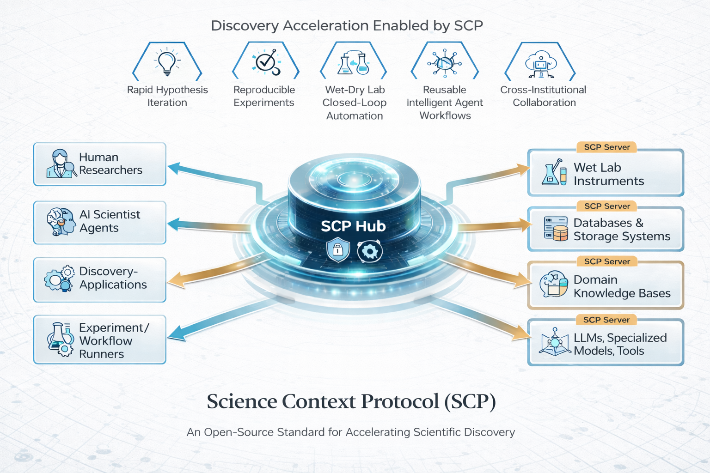

<div align="center">
  
  <h1>SCP: Science Context Protocol</h1>
  <p><strong>Science Context Protocol — Building a Global Collaboration Network for Autonomous Scientific Agents</strong></p>

  <p>
    <a href="https://discovery.intern-ai.org.cn/org/ailab/workspace/iframe?url=https://scphub.intern-ai.org.cn/">
      
    </a>
    <a href="https://arxiv.org/abs/2512.24189">
      
    </a>
    <a href="https://yankai96.github.io/SCP_Tool_List/">
      
    </a>
    <a href="https://github.com/InternScience/scp">
      
    </a>
    <a href="https://github.com/InternScience/scp/tree/main/skills">
      
    </a>
  </p>

  <p>
    
    
  </p>
</div>

---

## 🎯 Vision

> **SCP is dedicated to breaking down tool barriers in scientific research, enabling researchers to focus on the science itself, and empowering AI agents to become true "experiment designers."**

SCP (Science Context Protocol) is an **open-source standard protocol** designed to accelerate scientific discovery by building a **global collaboration network for autonomous scientific agents**, connecting heterogeneous scientific resources (software tools, AI models, datasets, workflow engines, lab instruments, etc.).

---

## 📑 Table of Contents

- [🎯 Vision](#-vision)
- [✨ Core Capabilities](#-core-capabilities)
- [🏗️ Architecture](#️-architecture)
- [🚀 Quick Start](#-quick-start)
- [🛠️ Tool Ecosystem](#️-tool-ecosystem)
- [🎓 Scientific Skills](#-scientific-skills)
  - [What Are Scientific Skills?](#what-are-scientific-skills)
  - [Skill Catalog by Domain](#skill-catalog-by-domain)
  - [Skill Highlights](#skill-highlights)
- [📊 Use Cases](#-use-cases)
- [🔬 SCP vs MCP](#-scp-vs-mcp)
- [🌐 Resources](#-resources)
- [📄 License](#-license)
- [🙏 Acknowledgments](#-acknowledgments)

---

## ✨ Core Capabilities

| Capability | Description |
|------------|-------------|
| 🔗 **Protocol-Level Connectivity** | Unified description and invocation of **2,200+** scientific resources (tools, models, instruments, etc.) |
| 🧠 **Intelligent Orchestration** | SCP Hub supports automated planning, execution, and monitoring of multi-step workflows |
| 🧪 **Dry-Wet Lab Integration** | Seamless integration of computational tools and lab equipment for closed-loop validation |
| 🤖 **Multi-Agent Collaboration** | Supports multiple AI agents working collaboratively within a unified context |
| 📋 **Full Lifecycle Management** | End-to-end traceability from registration, planning, and execution to archiving |
| 🔐 **Security & Access Control** | Fine-grained authentication and authorization mechanisms based on experiments |

---

## 🏗️ Architecture

<div align="center">
  
</div>

SCP adopts a **Hub-Spoke Architecture**:

```
┌─────────────────────────────────────────────────────────────┐
│                    SCP Client                               │
│            (Researchers / AI Scientists)                     │
└───────────────────────┬─────────────────────────────────────┘
                        │
                        ▼
┌─────────────────────────────────────────────────────────────┐
│               SCP Hub (Central Orchestrator)                 │
│     Intent Parsing · Workflow Generation · Task Scheduling   │
│                  · Permission Management                     │
└───────────────────────┬─────────────────────────────────────┘
                        │
        ┌───────────────┼───────────────┐
        ▼               ▼               ▼
┌──────────────┐ ┌──────────────┐ ┌──────────────┐
│  SCP Server  │ │  SCP Server  │ │  SCP Server  │
│ (Edge Node)  │ │ (Edge Node)  │ │ (Edge Node)  │
└──────┬───────┘ └──────┬───────┘ └──────┬───────┘
       │                │                │
  Tools/Models     Databases/       Compute
                   Instruments      Resources
```

- **SCP Hub**: Central orchestrator responsible for task scheduling and permission management
- **SCP Server**: Edge node interfacing with local resources
- **SCP Client**: User interface for researchers or AI scientists

---

## 🚀 Quick Start

### Installation

```bash
# Clone the repository
git clone https://github.com/InternScience/scp.git
cd scp

# Install dependencies
pip install -e .
```

### Usage

#### Option 1: Self-Hosted Deployment
Set up your own SCP Server and Hub for full control over deployment and management.

#### Option 2: Intern-Discovery Platform (Recommended)
Visit **[SCP Square](https://discovery.intern-ai.org.cn/org/ailab/workspace/iframe?url=https://scphub.intern-ai.org.cn/)** — we provide a managed SCP Hub where you can submit your own SCP Server to the square for cross-platform discovery and access.

---

## 🛠️ Tool Ecosystem

SCP has integrated **2,200+ scientific tools** spanning multiple disciplines:

<div align="center">

| Domain | Share | Representative Tool Types |
|--------|-------|--------------------------|
| 🧬 Biology & Related Technologies | 45.9% | Genome analysis, protein structure prediction |
| ⚛️ Physics | 21.1% | Quantum computing, materials simulation |
| 🧪 Chemistry | 11.6% | Molecular docking, reaction prediction |
| 🔧 Mechanics & Materials Science | 8.7% | Finite element analysis, molecular dynamics |
| 📐 Mathematics | 8.0% | Symbolic computation, optimization algorithms |
| 💻 Information Science & Computing | 4.6% | Machine learning, data mining |

</div>

🔗 **[View Complete Tool List](https://yankai96.github.io/SCP_Tool_List/)**

---

## 🎓 Scientific Skills

> Building upon tool standardization, SCP further introduces the concept of **"Scientific Skills (SCP Skills)"** — the first batch of **206 scientific skills** is now available in the [`skills/`](skills/) directory.

### What Are Scientific Skills?

Each Skill is an **independently callable, freely composable "research instruction"** that orchestrates multiple databases, computational models, and even device drivers behind the scenes, forming a reusable, standardized experiment template.

**For Researchers**: No need to deal with complex tool manuals and code debugging — focus your energy on the scientific questions themselves
**For AI Agents**: Skills become freely stackable "LEGO bricks," enabling agents to evolve from "tool users" to "experiment designers"

### Skill Catalog by Domain

All **206 skills** are organized into **8 major scientific domains**:

<div align="center">

| Domain | Skills | Representative Examples |
|--------|:------:|----------------------|
| 💊 **Drug Discovery & Pharmacology** | 71 | Target identification, ADMET prediction, virtual screening, molecular docking, drug safety & repurposing, clinical pharmacology |
| 🧬 **Genomics & Genetic Analysis** | 41 | Variant pathogenicity, cancer genomics, population genetics, rare disease, virus genomics, epigenomics |
| 🧬 **Protein Science & Engineering** | 38 | Structure prediction (ESMFold/AlphaFold), binding sites, mutation analysis, antibody & peptide design, enzyme engineering |
| 🧪 **Chemistry & Molecular Science** | 24 | Structure analysis, molecular fingerprints, SAR, material composition, natural products, metabolomics |
| ⚙️ **Physics & Engineering Computing** | 18 | Circuit analysis, thermodynamics, optics, electromagnetics, crystallography, unit conversion |
| 🔬 **Lab Automation & Literature Mining** | 7 | Protocol generation, PDF extraction, PubMed search, scientific literature mining, meta-analysis |
| 🌍 **Earth & Environmental Science** | 5 | Atmospheric science, wind energy assessment, seawater properties, oceanographic calculations |
| 📊 **Biomedical Database Integration** | 2 | OpenTargets disease-target queries, experimental data processing |

</div>

<details>
<summary><b>💊 Drug Discovery & Pharmacology — 71 Skills (click to expand)</b></summary>

`admet_druglikeness_report` · `affinity_maturation` · `alanine_scanning_pipeline` · `antibody_drug_development` · `atc_drug_classification` · `boltz2-binding-affinity` · `cancer_therapy_design` · `chemical_safety_assessment` · `clinical_pharmacology_report` · `clinical_trial_drug_profile` · `combinatorial_chemistry` · `comparative_drug_analysis` · `compound_to_drug_pipeline` · `disease-reversal-prediction` · `disease_compound_pipeline` · `disease_drug_landscape` · `disease_knowledge_graph` · `drug-screening-docking` · `drug_indication_mapping` · `drug_interaction_checker` · `drug_metabolism_study` · `drug_repurposing_screen` · `drug_safety_profile` · `drug_target_identification` · `drug_target_structure` · `drug_warning_report` · `drugsda-admet` · `drugsda-compound-retrieve` · `drugsda-data-valid` · `drugsda-denovo-sampling` · `drugsda-dleps` · `drugsda-drug-likeness` · `drugsda-esmfold` · `drugsda-file-transfer` · `drugsda-linker-sampling` · `drugsda-mol-properties` · `drugsda-mol-similarity` · `drugsda-mol2mol-sampling` · `drugsda-p2rank` · `drugsda-peptide-sampling` · `drugsda-prosst` · `drugsda-rgroup-sampling` · `drugsda-target-retrieve` · `enzyme_inhibitor_design` · `epigenetics_drug` · `fda-drug-risk-assessment` · `gene_to_drug_pipeline` · `gene_variant_drug_nexus` · `infectious_disease_analysis` · `lead_compound_optimization` · `molecular_docking_pipeline` · `one_health_analysis` · `opentargets-disease-target` · `orphan_drug_analysis` · `pandemic_preparedness` · `pediatric_drug_safety` · `personalized_medicine` · `pharmacogenomics_analysis` · `pharmacokinetics_profile` · `polypharmacology_analysis` · `precision_oncology` · `protein_drug_interaction` · `smiles_comprehensive_analysis` · `structural_pharmacogenomics` · `substance_toxicology` · `systems_pharmacology` · `toxicity_assessment` · `variant-pharmacogenomics` · `virtual_screening` · `gene-knowledge-integration` · `molecular-property-profiling`

</details>

<details>
<summary><b>🧬 Genomics & Genetic Analysis — 41 Skills (click to expand)</b></summary>

`biomarker_discovery` · `biosample_genomics` · `chromosome_analysis` · `comprehensive-variant-annotation` · `cross_species_genomics` · `epigenomic_landscape` · `gene_disease_association` · `gene_expression_atlas` · `gene_family_evolution` · `genetic_counseling_report` · `genome_annotation` · `go_term_analysis` · `microbiome_genomics` · `mouse_model_analysis` · `multispecies_gene_analysis` · `ncbi-gene-retrieval` · `ncbi_gene_deep_dive` · `organism_classification` · `phenotype-by-hpo-id` · `population_genetics` · `rare_disease_genetics` · `region-gene-elements` · `regulatory_region_analysis` · `snp_functional_analysis` · `tcga-gene-expression` · `tissue_specific_analysis` · `transcriptome_analysis` · `ucsc_genome_exploration` · `variant-clinical-significance` · `variant-cross-database-ids` · `variant-functional-prediction` · `variant-genomic-location` · `variant-gwas-associations` · `variant-population-frequency` · `variant_pathogenicity` · `virus_genomics` · `gene_comprehensive_lookup` · `gene_therapy_target` · `ensembl-sequence-retrieval` · `kegg-gene-search` · `multiomics_integration`

</details>

<details>
<summary><b>🧬 Protein Science & Engineering — 38 Skills (click to expand)</b></summary>

`alphafold_structure_pipeline` · `antibody_target_analysis` · `binding_site_characterization` · `blast_protein_analysis` · `comprehensive-protein-analysis` · `disease_protein_profiling` · `dna-rna-sequence-analysis` · `enzyme_engineering` · `full_protein_analysis` · `interproscan-domain-analysis` · `interproscan_pipeline` · `metabolomics_pathway` · `molecular_visualization_suite` · `mutation_impact_analysis` · `peptide-properties-calculation` · `protein-blast-search` · `protein-properties-calculation` · `protein_classification_analysis` · `protein_complex_analysis` · `protein_database_crossref` · `protein_engineering` · `protein_function_annotation` · `protein_interaction_network` · `protein_property_comparison` · `protein_quality_assessment` · `protein_similarity_search` · `protein_solubility_optimization` · `protein_structure_analysis` · `proteome_analysis` · `string-ppi-enrichment` · `structural_homology_modeling` · `synthetic_biology_design` · `uniprot-protein-retrieval` · `uniprot_deep_analysis` · `lab_protocol_from_literature` · `code_execution_analysis` · `molecular-descriptors-calculation` · `web_literature_mining`

</details>

<details>
<summary><b>🧪 Chemistry & Molecular Science — 24 Skills (click to expand)</b></summary>

`aliphatic_ring_analysis` · `bioassay_analysis` · `cas_compound_lookup` · `cell_line_assay_analysis` · `chembl-molecule-search` · `chemical-mass-percent-calculation` · `chemical-structure-analysis` · `chemical_patent_analysis` · `chemical_property_profiling` · `chemical_structure_comparison` · `compound-name-retrieval` · `compound_database_crossref` · `functional_group_profiling` · `molecular-format-conversion` · `molecular-properties-calculation` · `molecular-similarity-search` · `molecular_fingerprint_analysis` · `natural_product_analysis` · `polymer_property_analysis` · `pubchem-smiles-search` · `pubchem_deep_dive` · `smiles-to-cas-conversion` · `substructure_activity_search` · `material-density-volume-calculation`

</details>

<details>
<summary><b>⚙️ Physics & Engineering Computing — 18 Skills (click to expand)</b></summary>

`buoyancy-acceleration-calculation` · `capacitance-calculation` · `electrical_circuit_analysis` · `electromagnetic_analysis` · `energy_conversion` · `experimental_data_processing` · `geometric-volume-calculation` · `geometry_trigonometry` · `length_measurement` · `measurement-error-analysis` · `mobility_analysis` · `nuclear_physics` · `optical-frequency-calculation` · `optics_analysis` · `signal_processing` · `statistical_error_analysis` · `thermal_analysis` · `unit_conversion_suite`

</details>

<details>
<summary><b>🔬 Lab Automation & Literature Mining — 7 Skills (click to expand)</b></summary>

`biomedical-web-search` · `meta-analysis-execution` · `protocol-extraction-from-pdf` · `protocol-generation` · `protocol-to-executable-json` · `pubmed-article-search` · `scientific-literature-search`

</details>

<details>
<summary><b>🌍 Earth & Environmental Science — 5 Skills (click to expand)</b></summary>

`atmospheric-science-calculations` · `oceanographic-seawater-properties` · `seawater-freezing-temperature` · `seawater-sound-speed-calculation` · `wind-site-assessment`

</details>

<details>
<summary><b>📊 Other — 2 Skills</b></summary>

`seismic-waveform-processing` · `unit-conversion-nanoscale`

</details>

### Skill Highlights

- 📦 **206 Skills** in total, each containing a complete `SKILL.md` with documentation, test cases, and runnable Python code
- ✅ **All skills** have been **tested against live SCP endpoints** and verified to work
- 🔧 **250+ distinct tools** orchestrated across **31 SCP Servers**
- 🌍 Covering **8 major scientific domains** and **112+ sub-disciplines**
- 🔑 Each skill includes authentication setup — just replace `<YOUR_SCP_HUB_API_KEY>` with your own key from the [SCP Platform](https://discovery.intern-ai.org.cn/org/ailab/workspace/app-center)

---

## 📊 Use Cases

<div align="center">

| Scenario | Description |
|----------|-------------|
| 📝 **Automated Experiment Protocol Design** | Generate executable experiment protocols from natural language objectives |
| 📄 **PDF Protocol Auto-Reproduction** | Extract experiment steps from PDFs and execute them automatically |
| 💊 **AI-Driven Molecular Screening** | Integrated QED scoring, ADMET prediction, and molecular docking |
| 🧪 **Dry-Wet Integrated Protein Engineering** | Closed-loop workflow from sequence design to experimental validation |

</div>

📖 For detailed case studies, please refer to our [Technical Report](https://arxiv.org/abs/2512.24189) or [User Cases](https://github.com/InternScience/scp/tree/main/UserCases)

---

## 🔬 SCP vs MCP

<div align="center">

| Feature | MCP | SCP |
|---------|-----|-----|
| Protocol Standardization | General tool invocation | Structured, complete scientific experiment workflows |
| High-Throughput Experiment Support | No built-in experiment management | Supports batch experiments and context management |
| Multi-Agent Collaboration | Point-to-point communication | Centralized orchestration and task distribution |
| Wet-Lab Equipment Integration | Requires custom adapters | Standardized device drivers and interfaces |

</div>

---

## 🌐 Resources

<div align="center">

| Resource | Link |
|----------|------|
| 🛠️ **SCP Tool Square** | [Explore 2,200+ integrated tools](https://yankai96.github.io/SCP_Tool_List/) |
| 🚀 **SCP Skills Tutorial** | [Docker setup, model switching & skills usage guide](tutorial.md) |
| 📖 **Documentation (Chinese)** | [Detailed user guide](https://github.com/InternScience/scp/blob/main/SCP中文手册.md) |
| 📄 **Technical Report** | [SCP design and experiment details](https://arxiv.org/abs/2512.24189) |
| 💬 **Community** | [Discussions and Q&A](https://www.shlab.org.cn/news/5444176) |

</div>

---

## 📄 License

This project is open-sourced under the **Apache License 2.0**.

---

## 🙏 Acknowledgments

SCP is developed by **Shanghai AI Laboratory**. We thank the open-source community for their support.

If you use SCP in your research, please cite our technical report:

```bibtex
@article{jiang2025scp,
  title={SCP: Accelerating Discovery with a Global Web of Autonomous Scientific Agents},
  author={Jiang, Yankai and Lou, Wenjie and Wang, Lilong and Tang, Zhenyu and Feng, Shiyang and Lu, Jiaxuan and Sun, Haoran and Pan, Yaning and Gu, Shuang and Su, Haoyang and others},
  journal={arXiv preprint arXiv:2512.24189},
  year={2025}
}
```

---

<div align="center">
  <p>
    <strong>Made with ❤️ by Shanghai AI Laboratory</strong>
  </p>
  <p>
    <a href="https://www.shlab.org.cn/">
      
    </a>
  </p>
</div>
